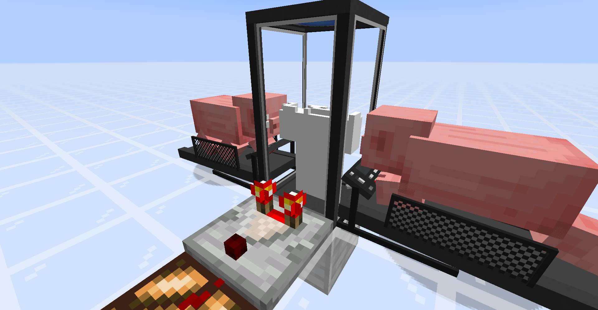
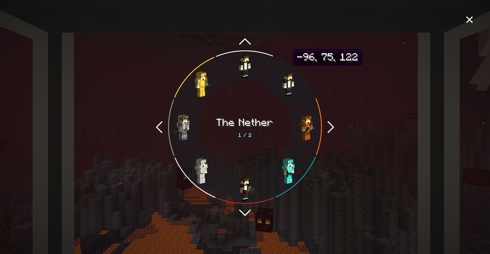

# NeoSync Community Port

> **One mind. Many bodies.**

NeoSync provides *shells* — clones of the player, each with their own inventory, experience, and gamemode, that you can transfer your consciousness into.

This repository contains an **unofficial community-maintained NeoForge port for Minecraft 26.2**.

Development of a **Minecraft 26.3 / NeoForge 26.3 version is currently in progress**.

The project is based on the NeoForge port by **BreakinBlocks**, which itself ports the Fabric reimplementation by [Kir_Antipov](https://github.com/Kir-Antipov/sync-fabric) of the original [Sync](https://github.com/iChun/Sync) mod by [iChun](https://github.com/iChun).

This community port is not an official release from the original NeoSync developers.

---

## Current Version

* **Minecraft:** 26.2
* **Mod Loader:** NeoForge 26.2
* **Java:** 25
* **Side:** Client + Server

### Minecraft 26.3

A **Minecraft 26.3 / NeoForge 26.3 port is currently being developed**.

The 26.3 branch should be considered **work in progress / experimental** until the migration and testing process is complete.

---

## How to play

1. Craft a **shell constructor** and place it.

2. Right-click it with an empty hand to provide a genetic sample.

   > ⚠️ With default config this will **kill you**. 20 HP (40 in hardcore). Eat a golden apple for more health, hold a totem of undying, or enable `warnPlayerInsteadOfKilling` in the config.

3. Power the constructor: place a **treadmill** touching any side of it, lure a **pig** or **wolf** onto the front block, and piggawatts flow.

   

   > A comparator on the constructor tracks build progress, which is also displayed in Jade.

4. Once the shell is built, craft a **shell storage**, place it, and supply redstone power or FE from any compatible tech mod.

5. When the storage doors open, walk in. A radial menu appears with your shells:

   

6. Pick a shell.

7. **Sync.**

---

## Features

* Create and grow additional player Shells
* Transfer between multiple bodies
* Cross-dimensional syncing
* Separate inventory for each Shell
* Separate experience for each Shell
* Separate gamemode for each Shell
* Radial Shell selection menu
* Automatic syncing after death
* Shell Constructor
* Shell Storage
* Treadmill energy generation
* Forge Energy support
* Redstone power support
* Dyeable Shell Storages
* Comparator output
* Shell Storage automation
* Configurable death/sync priority
* Multiplayer support
* Custom dimension support
* JEI integration
* Jade integration
* Administrative Shell commands
* Respawn anchors
* Ghost Shell repair tools

---

## Notes

* Right-click a shell storage with **dye** to color-code it.
* Syncing works cross-dimensional and custom dimensions are supported.
* If you die in a shell, you auto-sync back to your original body, or to a random remaining shell if the original is gone.
* Shell deaths **don't** count towards your death counter.
* The dead shell's inventory drops at its location.
* Grave mods such as Simple Tombs can capture dropped inventories. See [Mod integration](#mod-integration) for caveats.
* Hoppers connected to a shell storage can equip or unequip armor/tools on the stored shell.
* Shell storage needs continuous power to keep its shell alive, depending on configuration.
* Shell storage accepts redstone and/or Forge Energy.
* Comparator output from a shell container reports either *build progress* or *inventory fullness*.
* Right-click the container with a **wrench** (`minecraft:stick` by default) to toggle comparator modes.
* Shell containers drop themselves when mined.
* Any pickaxe works.
* Silk Touch is not required.

---

## Config

Config file:

`config/neosync-common.toml`

Key options:

| Key                                                | Default                                                                      | Effect                                                                       |
| -------------------------------------------------- | ---------------------------------------------------------------------------- | ---------------------------------------------------------------------------- |
| `enableInstantShellConstruction`                   | `false`                                                                      | Instant shell builds in creative                                             |
| `warnPlayerInsteadOfKilling`                       | `false`                                                                      | Don't kill low-HP players on fingerstick                                     |
| `fingerstickDamage` / `hardcoreFingerstickDamage`  | `20` / `40`                                                                  | HP consumed per shell                                                        |
| `shellConstructorCapacity`                         | `256000`                                                                     | FE needed for a full shell                                                   |
| `shellStorageCapacity` / `shellStorageConsumption` | `320` / `16`                                                                 | FE buffer + per-tick drain keeping a shell alive                             |
| `shellStorageAcceptsRedstone`                      | `true`                                                                       | Accept raw redstone as power                                                 |
| `shellStorageMaxUnpoweredLifespan`                 | `20`                                                                         | Ticks a storage keeps its shell alive without power                          |
| `energyMap`                                        | chicken=2, pig=16, player=20, wolf=22, villager=25, creeper=80, enderman=160 | FE/tick per entity on a treadmill                                            |
| `syncPriority`                                     | `NATURAL`                                                                    | Which shell to pick on death. Values: `NATURAL`, `NEAREST`, or any dye color |
| `wrench`                                           | `minecraft:stick`                                                            | Item that cycles a container's comparator output type                        |

---

# Commands

All commands are listed under:

`/neosync`

Most commands require gamemaster permission.

`anchor` and `ghostshells` are also available to the host in single player.

---

## `/neosync select [<targets>]`

Opens the Shell radial menu wherever the player is standing, with no Shell Storage required, and allows them to sync directly into any finished Shell.

With no argument, it targets the command sender.

Players with no finished Shell are skipped with a message.

The command returns the number of menus opened.

### When standing in a Shell Storage

Standing in an empty Shell Storage still works normally.

The body stays inside the storage with everything it was carrying, and the player wakes up inside the Shell they selected.

### When away from a Shell Storage

Away from a Shell Storage there is no container to leave the original body in.

The player is therefore killed and moved into the selected Shell once they respawn.

This death follows the ordinary death system, meaning grave mods can keep the player's items and XP.

Without a grave mod, normal death drops occur.

A player who is already dead can also select a Shell from the death screen.

Nothing happens until they respawn, after which they arrive inside the selected Shell instead of their normal spawn point.

This is what allows a single-use anchor to cover exactly one death.

---

## `/neosync anchor set <targets> <dimension> <x y z> [<temporary>]`

Gives each target a respawn anchor at the specified location.

An anchor behaves like a Shell inside the radial menu, but there is no physical block involved.

Syncing to an anchor creates a fresh clone with:

* Full health
* Empty inventory
* The specified coordinates
* The specified dimension

Setting another anchor at exactly the same location and dimension replaces the existing one.

Pass:

`true`

for `temporary` to make the anchor single-use.

The anchor is removed immediately when the player syncs into it, meaning it covers exactly one death.

Omit the argument or pass:

`false`

to create a permanent anchor.

The command returns the number of players given an anchor.

---

## `/neosync anchor ensure <targets> <dimension> <x y z>`

Works similarly to:

`anchor set ... true`

but only affects players who currently have nothing available to sync into.

That means they must have:

* No finished Shell
* No existing anchor

Players who still have somewhere to go are left unchanged.

The command is safe to run repeatedly, making it suitable for login hooks or timers that prevent players from becoming stranded.

It returns the number of players actually given an anchor.

If everyone already has a Shell or anchor, it returns:

`0`

---

## `/neosync anchor list <targets>`

Lists each target's anchors.

Single-use anchors are identified in the output.

The command returns the total number of anchors across all selected targets.

---

## `/neosync anchor remove <targets> [<dimension> <x y z>]`

Removes anchors from the selected players.

When coordinates are supplied, only the anchor at that exact location is removed.

Without coordinates, every anchor belonging to the selected target is removed.

The command returns the number of anchors removed.

---

## `/neosync ghostshells <sync|remove|repair> <targets> [<x y z>]`

Cleans up Shells that appear inside a player's radial menu but no longer exist in the world.

This can happen when:

* A Shell Storage was destroyed
* A chunk was rolled back
* World data changed unexpectedly
* A Shell entity became disconnected from its storage data

Anchors are never affected by this command.

Provide coordinates to operate on one Shell, or omit them to scan every Shell belonging to the player.

### Modes

#### `sync`

Attempts to repair broken Shells and removes anything that cannot be repaired.

#### `repair`

Attempts to repair broken Shells and reports anything that cannot be repaired without deleting it.

#### `remove`

Deletes Ghost Shell entries without attempting a repair.

> **Note:** Running a sweep without coordinates also marks all of that player's Shells as fully built. Any Shell currently under construction will finish immediately.

---

# Mod integration

## JEI

[JEI](https://www.curseforge.com/minecraft/mc-mods/jei)

Adds informational descriptions to NeoSync blocks explaining how the Shell system works.

It also provides a **Treadmill Energy Sources** category listing every supported entity and its FE/tick output.

This information is driven by the configured `energyMap`.

---

## Jade

[Jade](https://www.curseforge.com/minecraft/mc-mods/jade)

Provides crosshair information for:

* Shell Constructors
* Shell Storages
* Treadmills

Information can include:

* Owner
* Build progress
* Shell color
* Powered state
* Energy level

JEI and Jade are both optional.

NeoSync works without them.

---

# Grave / death-handling mods

NeoSync can coexist with grave mods such as **Simple Tombs**, but there are differences depending on the death path.

Only integrations that hook into `LivingDropsEvent` work completely with the cross-Shell death path.

## Original-body death

Original-body death follows the vanilla death flow.

The following events fire normally:

* `LivingDeathEvent`
* `LivingDropsEvent`
* `PlayerRespawnEvent`

Grave mods therefore behave as they normally would without NeoSync.

---

## Shell death with another Shell available

When a Shell dies and another valid Shell is available, NeoSync intercepts the death.

Vanilla `die()` is cancelled and the player automatically syncs into the next Shell.

`LivingDropsEvent` still fires, allowing grave mods to create a grave at the dead Shell's location containing its inventory.

However:

* `LivingDeathEvent` does **not** fire
* `PlayerRespawnEvent` does **not** fire

---

## Syncing away from a Shell Storage

Syncing while away from a Shell Storage performs a normal vanilla death followed by movement into the chosen Shell after respawning.

All three standard death events fire.

Grave mods therefore behave normally for this death path.

---

# Simple Tombs

For Simple Tombs specifically:

* Graves are placed at the dead Shell's location.
* Graves contain the Shell's full inventory.
* Walk back to the grave to retrieve the items.
* The `KEEPPARTS` option does **not** carry soulbound hotbar or armor items across a cross-Shell automatic sync.
* Those items instead enter the grave with the rest of the inventory.

For consistent behaviour across the different NeoSync death paths, consider using:

`KEEPPARTS=NONE`

and rely on the grave for the complete inventory.

If:

`KEYGIVEN=true`

the grave key is placed inside the grave alongside the other dropped items.

If specific compatibility with another grave or death-handling mod is needed, please open an issue on the community port repository.

---

# Minecraft 26.2 Community Port

This version updates NeoSync for **Minecraft 26.2 and NeoForge 26.2**.

The port includes migration work covering areas such as:

* Minecraft 26.2 registry changes
* NeoForge 26.2 API changes
* Block registration
* Colored block families
* Entity systems
* Entity IDs
* Player rendering
* Shell rendering
* Block entity rendering
* Camera handling
* Shell selection GUI
* Networking
* Data generation
* Recipe APIs
* Forge Energy support
* Server compatibility
* Multiplayer compatibility
* Java 25

The goal is to preserve NeoSync's existing gameplay and functionality while making it work correctly with the Minecraft 26.2 / NeoForge 26.2 API changes.

---

# Minecraft 26.3 Development

Work has started on a **Minecraft 26.3 / NeoForge 26.3 version of NeoSync**.

The 26.3 port will migrate the existing 26.2 Community Port to the newer Minecraft and NeoForge APIs.

Development areas include:

* Registry/API migration
* Rendering changes
* Entity API changes
* Networking changes
* Recipe and data generation changes
* Shell rendering
* Player syncing
* Camera behaviour
* Client UI
* Forge Energy compatibility
* Optional mod integrations
* Dedicated server testing
* Multiplayer testing

The **26.3 version is currently under development** and should not be considered a stable release until testing is complete.

The existing **Minecraft 26.2 version remains the current Community Port release**.

---

# Community Port Notice

This project is an **unofficial community-maintained port**.

It is not an official release from:

* iChun
* Kir_Antipov
* BreakinBlocks
* Saereth
* The upstream NeoSync developers

Issues specific to the **Minecraft 26.2 or Minecraft 26.3 Community Port** should be reported to this project's issue tracker rather than upstream.

If an issue can also be reproduced on an official upstream NeoSync version, it may also be appropriate to report it upstream.

---

# Credits

**Original Sync concept and mod:**
[iChun](https://github.com/iChun)

**Fabric reimplementation:**
[Kir_Antipov](https://github.com/Kir-Antipov/sync-fabric)

**NeoForge 1.21.1 port:**
BreakinBlocks

**NeoSync upstream development:**
NeoSync contributors / Saereth

**Minecraft 26.2 Community Port:**
GamingProVideos

**Minecraft 26.3 Port Development:**
GamingProVideos

A huge thank you to everyone who created, maintained, reimplemented, and ported Sync and NeoSync.

---

# License

NeoSync is distributed under the **MIT License**.

Original code by [Kir_Antipov](https://github.com/Kir-Antipov).

NeoForge porting work by BreakinBlocks.

Minecraft 26.2 and ongoing 26.3 community port work by GamingProVideos.

Original Sync concept and mod by [iChun](https://github.com/iChun).

The original copyright notices and license information are retained.

See [LICENSE](LICENSE) for complete license information.

---

> **One mind. Many bodies.**

**Minecraft 26.2 available now — Minecraft 26.3 port in development.**
